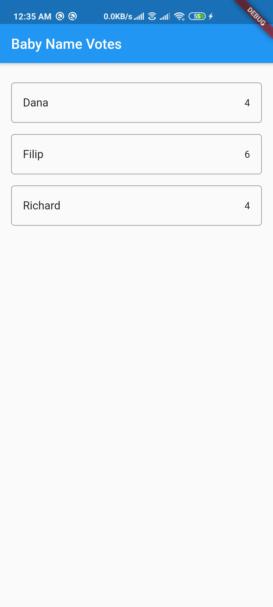

# baby_names flutter app

The app helps new parents choose baby names by letting friends and family vote for their favorites. Specifically, the app accesses a Cloud Firestore database, and a user action in your app (i.e., tapping a name option) updates the database atomically.

Firebase for Flutter codelab for building this app: https://codelabs.developers.google.com/codelabs/flutter-firebase/#0

baby names app db on Cloud Firestore: https://console.firebase.google.com/u/0/project/baby-names-app-db-f9a79/database/firestore/data~2Fbaby~2Fdana

